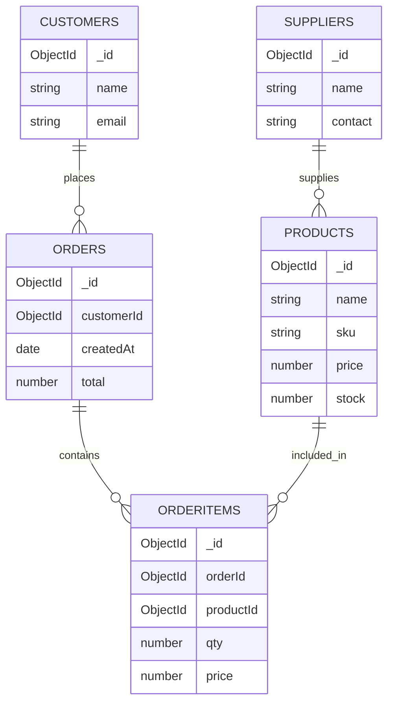

# DBMS Concepts Used in this Project

This document lists the DBMS concepts used in the `retail-inventory` project, explains why they were used, and includes diagrams and short examples you can use when explaining the design to your teacher.

## Collections (Analogous to Tables)
- `products`: product catalog (sku, name, price, stock, supplierId, etc.)
- `customers`: customer profiles (name, email, phone, address)
- `orders`: orders placed (customerId, items[], totals, createdAt)
- `orderItems` (logical): each order stores an `items` array rather than a separate table; each item contains a `productId`, `qty`, `priceSnapshot`
- `suppliers`: supplier info
- `users`: application users / auth

Why collections: MongoDB is a document DB; collections store JSON-like documents for each entity.

---

## Schema Design & Denormalization
- Orders store embedded `items` containing a product snapshot (name, price) rather than only `productId`.
  - Reason: preserve historical price and product info at time of sale.
  - Trade-off: duplication of product data increases storage but simplifies reads.

- Customer data is normalized (stored in `customers`) and referenced from `orders` via `customerId`.
  - Reason: customer profile is updated frequently and shared across many orders.

### Example: order document shape

```json
{
  "_id": "ObjectId(...)",
  "customerId": "ObjectId(...)",
  "items": [
    {"productId": "ObjectId(...)","name":"Widget A","price":19.99,"qty":2},
    {"productId": "ObjectId(...)","name":"Widget B","price":9.99,"qty":1}
  ],
  "total": 49.97,
  "createdAt": "2026-05-06T..."
}
```

---

## Relationships (References vs Embedding)
- Reference: `orders.customerId` → `customers._id` (one-to-many)
- Embed: order `items` embedded inside each order (one-to-few, read-heavy)

Mermaid ER diagram (explain on slides):



> Note: In the app `order.items` are embedded documents; this ER diagram shows logical relationships for teaching purposes.

---

## Indexing
- Common indexes in this project:
  - `products.sku` (fast lookups by SKU)
  - `products.stock` (range queries to find low-stock items)
  - `customers.email` (unique index for login)
  - `orders.createdAt` (sort recent orders)
  - Compound index for reports (e.g., `{ 'createdAt': 1, 'items.productId': 1 }`)

Why indexing matters: reduces collection scan cost and speeds up queries used in pages like Orders list and Reports.

---

## Aggregation Pipelines (Used for Reports)
- Reports such as Sales Summary, Top Products, and Inventory Status use MongoDB aggregation pipelines.

Example: simple sales summary aggregation (pseudo-code):

```js
db.orders.aggregate([
  { $unwind: "$items" },
  { $group: {
      _id: null,
      totalSales: { $sum: { $multiply: ["$items.qty", "$items.price"] } },
      orders: { $sum: 1 }
  } },
  { $project: { _id: 0, totalSales: 1, orders: 1 } }
])
```

Explain: `$unwind` turns each array element into a document, `$group` aggregates across orders.

---

## Transactions & Concurrency
- When creating an order we need to:
  1. Create the `orders` document.
  2. Decrement `products.stock` for each item.

- Best practice: use MongoDB multi-document transactions (supported on replica sets) so both steps succeed or both fail.

Example (high level):

```js
const session = await mongoose.startSession();
await session.withTransaction(async () => {
  await Order.create([orderDoc], { session });
  for (const item of order.items) {
    await Product.updateOne({ _id: item.productId }, { $inc: { stock: -item.qty } }, { session });
  }
});
session.endSession();
```

Fallback when transactions are not used: careful ordering (create order after stock update or use application-level compensating actions) — explain the failure modes.

---

## Replication, High-Availability, Backups
- For production, MongoDB Atlas provides a replica set (primary + secondaries) for redundancy and read-scaling.
- Backups: Atlas automated snapshots or scheduled backups; explain why snapshots are essential before schema changes.

Mermaid graph for architecture:

```mermaid
graph LR
  A[Client (React)] --> B[API Server (Express + Node.js)]
  B --> C[MongoDB Atlas Replica Set]
  C --> D[Backups / Snapshots]
  B --> E[Auth / JWT]
```

---

## Connection & Security
- Connection string: `MONGO_URI` in the server `.env` — used by `mongoose.connect(MONGO_URI)`.
- IP Access List (Atlas): the DB blocks connections from unknown IPs; you must whitelist your IP or use `0.0.0.0/0` for demo only.
- Authentication: use user/password in the connection string; rotate credentials in production.
- JWT secret stored in `.env` for auth token signing; keep out of source control.

---

## Query Patterns & Performance Tips
- Use projection to return only needed fields: `find({}, { name:1, price:1 })`.
- For paginated lists use range queries on indexed `createdAt` or `_id` with limit+sort.
- Avoid large $lookup on huge collections; prefer denormalized data or pre-aggregated collections for reports.
- Consider caching heavy reports (Redis) if aggregation is expensive.

---

## Data Seeding & Test Data
- The project includes a `seed` script that inserts demo `products`, `customers`, and `orders`.
- Seeding is helpful for demoing features like Reports and CSV export.

---

## Example Talking Points for Presentation
- "Orders embed line items so we keep a snapshot of product price at sale time. This helps us report historical revenue even if product prices change later."
- "For operations that modify both orders and inventory, we use transactions so we don't end up with negative stock or orphaned orders."
- "Reports are backed by MongoDB aggregation pipelines — unwind the items, group by product, and sum totals for Top Products."

---

## Where to find it in code
- Server DB connection and models: [server](server)
- Seed script: [server/scripts/seed.js](server/scripts/seed.js)
- Example aggregation usage: [server/controllers/reportsController.js](server/controllers/reportsController.js)

(See the repository for exact file locations.)

---

If you want, I can also:
- generate PNG/SVG exports of the diagrams, or
- produce a one-page slide with the main diagrams and talking points you can use during your demo.

End of DBMS explainer.
