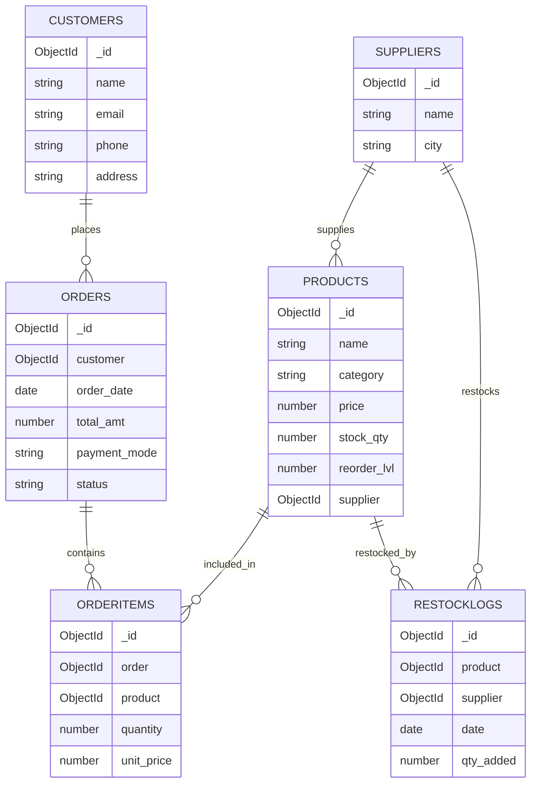
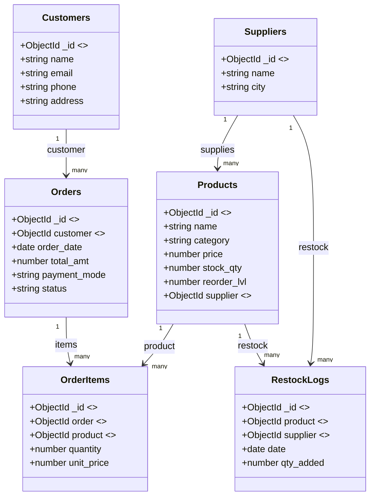
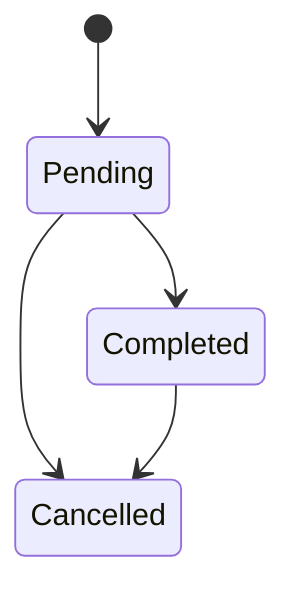
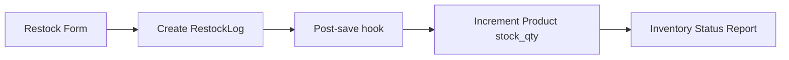
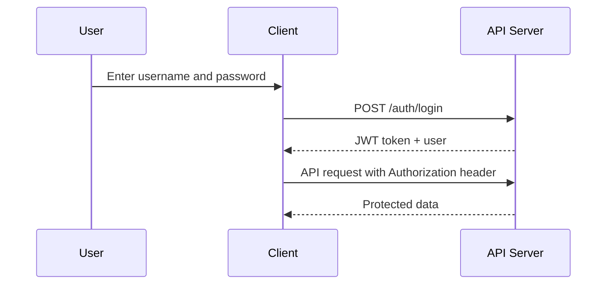
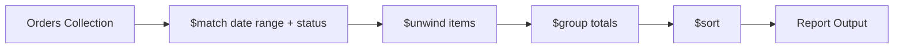
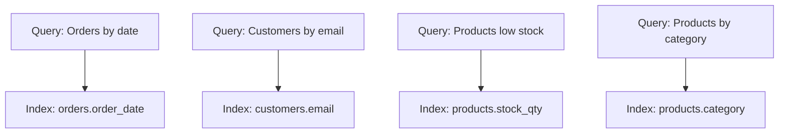
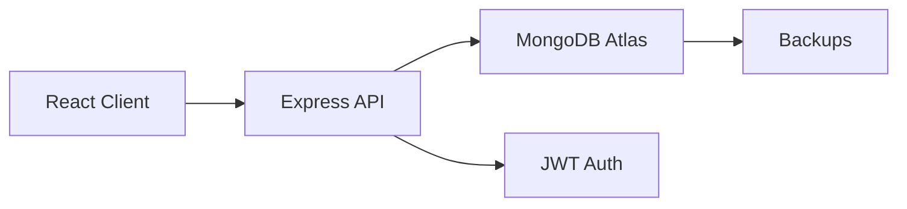

# Relations and Diagrams

This file captures the project ER diagrams, relational schema, and the key data concepts used in RetailIQ.

## Logical ER Diagram



One-line explanation: This ER diagram shows the main entities and how orders and restocks connect customers, products, and suppliers.

---

## Relational Schema (PK/FK View)



One-line explanation: This schema view makes primary and foreign key relationships explicit for a relational model mapping.

---

## Document Model for Orders (Embedded Items)

```mermaid
flowchart TD
  A[Order Document] --> B[items[] array]
  B --> C[productId]
  B --> D[quantity]
  B --> E[unit_price]
  A --> F[customerId]
  A --> G[total_amt]
```

One-line explanation: Orders embed line items to preserve price and quantity at the time of sale.

---

## Order Lifecycle



One-line explanation: Orders move through status states to control inventory updates and reporting.

---

## Restock Flow



One-line explanation: Restock logs drive inventory updates and feed reporting views.

---

## Authentication Flow (JWT)



One-line explanation: The client logs in once and then uses JWT to access protected routes.

---

## Report Aggregation Pipeline



One-line explanation: Reports use MongoDB aggregation stages to compute sales and top products.

---

## Index Usage Map



One-line explanation: Indexes speed up frequent filters used in lists and reports.

---

## System Architecture



One-line explanation: The app follows a client API database architecture with JWT-based authentication.

---

## Concepts Used (Summary)
- One-to-many relationships (customers to orders, suppliers to products)
- Embedded documents for order line items
- Aggregation pipelines for reports
- Indexing for faster searches
- Role-based access control with JWT
- Data validation in controllers and models
